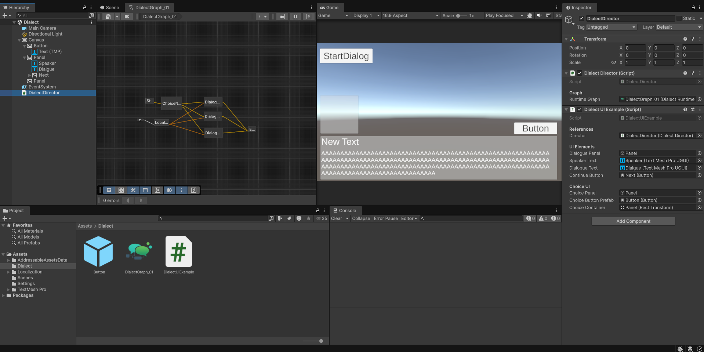

# Dialect


 


A modular, graph-based dialogue system for Unity with first-class localization support and editor tooling integration (Graph Tools).

Table of Contents
- Overview
- Key Concepts
- Nodes
- Localization
- Runtime API
- Example Usage
- Extensibility
- How to create a graph in the Editor
- Best Practices
- Contributing & Next Steps

## Overview

Dialect allows you to author conversations as visual graphs in the Unity Editor and converts them into a compact runtime representation (`DialectRuntimeGraph`). At runtime a `DialectDirector` component executes the graph, raising events for UI and controlling flow, choices and conditional branching.

Main features:
- Visual authoring using Graph Toolkit
- Importer that converts editor graph to `DialectRuntimeGraph` (ScriptableObject)
- Localization-ready (uses Unity's `LocalizedString` where needed)
- Built-in nodes: Dialogue, Choice, Condition, Action, End, and a reusable Localized node

## Key Concepts

- Graph (`DialectDirectorGraph`): the editable asset you create in the Editor.
- Editor Nodes: visual building blocks used while creating dialogues.
- Runtime Nodes (`RuntimeNode`): serializable nodes inside `DialectRuntimeGraph` used by the director at runtime.
- `DialectDirector`: MonoBehaviour that runs the runtime graph and exposes events for UI.

## Nodes (summary)

- StartNode — entry point of the graph
- DialogueNode — holds speaker and text (string or `LocalizedString`)
- ChoiceNode — multiple choice options (strings or `LocalizedString` references)
- ConditionNode — evaluates a `DialectCondition` and branches to True/False
- ActionNode — runs a `DialectAction` (custom logic)
- EndNode — ends the dialogue
- LocalizedNode — small utility node that encapsulates a `LocalizedString` for reuse

Editor nodes implement `IConvertibleToRuntime` to produce `RuntimeNode` instances during import.

## Localization

Dialect integrates with Unity's Localization package. Editor fields for speaker or text can connect to a `LocalizedNode` which stores a `LocalizedString`. When a runtime node has a `LocalizedString`, the `DialectDirector` will emit events with the localized text (and will re-process the current node when the selected locale changes via `LocalizationSettings.SelectedLocaleChanged`).

Tips:
- Use `LocalizedString` for any text that needs runtime language switching.
- Static labels can remain plain strings.

## Runtime API

Main component: `DialectDirector` (MonoBehaviour)

Public events:
- `event Action<string, string> OnDialogueShown` — invoked when a dialogue node is shown (speakerName, dialogueText).
- `event Action<string[]> OnChoiceShown` — invoked when a choice node is shown (array of choice texts).
- `event Action OnDialogueEnded` — invoked when the dialogue finishes.

Key methods:
- `void StartDialogue()` — starts the graph from the initial node assigned in `runtimeGraph`.
- `void AdvanceDialogue(int choiceIndex = 0)` — advance to the next node; specify choiceIndex when selecting choices.
- `int GetCurrentChoiceCount()` — returns number of choices in the current node.
- `bool IsRunning()` — returns whether the director is running.

Behavior notes:
- Director calls `RuntimeNode.Execute(context)` for the current node. Nodes request UI updates via the provided context callbacks.
- On locale change, the director re-processes the current node to refresh localized texts.

## Example Usage (C#)

```csharp
using Dialect;
using TMPro;
using UnityEngine;
using UnityEngine.UI;

public class DialectUIExample : MonoBehaviour
{
    [Header("References")]
    public DialectDirector director;
   
    [Header("UI Elements")]
    public GameObject dialoguePanel;
    public TextMeshProUGUI speakerText;
    public TextMeshProUGUI dialogueText;
    public Button continueButton;
   
    [Header("Choice UI")]
    public GameObject choicePanel;
    public Button choiceButtonPrefab;
    public Transform choiceContainer;

    void Start()
    {
        if (director != null)
        {
            director.OnDialogueShown += ShowDialogue;
            director.OnChoiceShown += ShowChoices;
            director.OnDialogueEnded += OnDialogueEnded;
        }

        if (continueButton != null)
        {
            continueButton.onClick.AddListener(() => director.AdvanceDialogue());
        }

        HideAll();
    }

    void OnDestroy()
    {
        if (director != null)
        {
            director.OnDialogueShown -= ShowDialogue;
            director.OnChoiceShown -= ShowChoices;
            director.OnDialogueEnded -= OnDialogueEnded;
        }

        if (continueButton != null)
        {
            continueButton.onClick.RemoveAllListeners();
        }
    }
        
    public void StartDialogue()
    {
        if (director != null)
        {
            director.StartDialogue();
        }
    }

    void ShowDialogue(string speaker, string dialogue)
    {
        if (dialoguePanel != null)
        {
            dialoguePanel.SetActive(true);
        }

        if (choicePanel != null)
        {
            choicePanel.SetActive(false);
        }

        if (speakerText != null)
        {
            speakerText.text = speaker;
            speakerText.gameObject.SetActive(!string.IsNullOrEmpty(speaker));
        }

        if (dialogueText != null)
        {
            dialogueText.text = dialogue;
        }

        if (continueButton != null)
        {
            continueButton.gameObject.SetActive(true);
        }
    }

    void ShowChoices(string[] choices)
    {
        if (dialoguePanel != null)
        {
            dialoguePanel.SetActive(false);
        }

        if (choicePanel != null)
        {
            choicePanel.SetActive(true);
        }

        ClearChoices();

        for (int i = 0; i < choices.Length; i++)
        {
            int choiceIndex = i;
            Button choiceButton = Instantiate(choiceButtonPrefab, choiceContainer);
                
            TextMeshProUGUI buttonText = choiceButton.GetComponentInChildren<TextMeshProUGUI>();
            if (buttonText != null)
            {
                buttonText.text = choices[i];
            }

            choiceButton.onClick.AddListener(() => OnChoiceSelected(choiceIndex));
            choiceButton.gameObject.SetActive(true);
        }
    }

    void OnChoiceSelected(int index)
    {
        ClearChoices();
            
        if (director != null)
        {
            director.AdvanceDialogue(index);
        }
    }

    void ClearChoices()
    {
        if (choiceContainer != null)
        {
            foreach (Transform child in choiceContainer)
            {
                Destroy(child.gameObject);
            }
        }
    }

    void OnDialogueEnded()
    {
        HideAll();
    }

    void HideAll()
    {
        if (dialoguePanel != null)
        {
            dialoguePanel.SetActive(false);
        }

        if (choicePanel != null)
        {
            choicePanel.SetActive(false);
        }

        ClearChoices();
    }
}
```



## Extensibility

- Conditions and actions use interfaces (`DialectCondition`, `DialectAction`) — implement those interfaces to plug game logic into nodes.
- Create new runtime node types by subclassing `RuntimeNode` and implement a matching editor node that converts to it (implement `IConvertibleToRuntime`).

## How to create a graph in the Editor

1. Assets > Create > Dialect Director Graph
2. Open the graph with the Graph Toolkit editor, add nodes and connect execution ports and inputs
3. Save the asset — the `DialectDirectorImporter` will produce a `DialectRuntimeGraph` inside the asset which you can assign to a `DialectDirector` at runtime

## Best practices

- Keep graphs modular: use action nodes to call game logic instead of embedding it inside nodes.
- Prefer `LocalizedString` for any user-facing text that requires translation.
- Validate conditions and actions in small unit tests where possible.
---